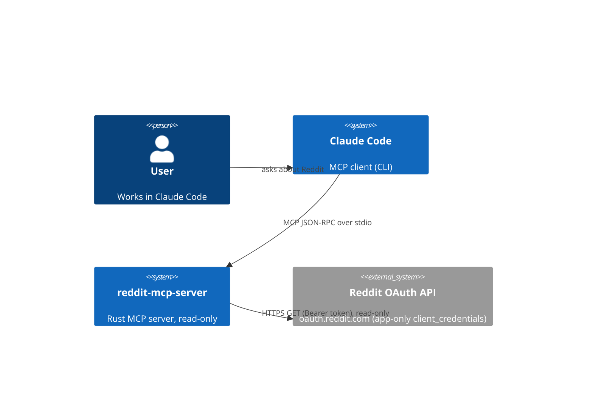
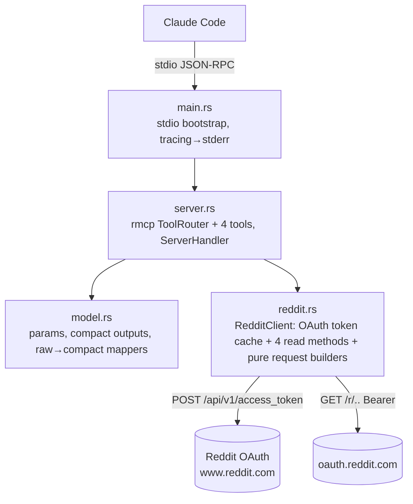

# C4 model — reddit-mcp-server

Architecture source of truth. Update on any architecture change (tools, deps, data flows).

## Level 1 — Context

## Level 2 — Container / Components

Single Rust binary launched by Claude Code as a stdio subprocess.

### Tools (read-only)
| Tool | reddit.rs method | Endpoint |
|---|---|---|
| `reddit_listing` | `get_listing` | `/r/{sub}/{sort}` |
| `reddit_search` | `search` | `/r/{sub}/search` or `/search` |
| `reddit_comments` | `get_comments` | `/comments/{id}` (optionally sub-scoped) |
| `reddit_subreddit_about` | `get_subreddit_about` | `/r/{sub}/about` |

## Key decisions
- **Read-only by construction**: app-only `client_credentials` grant; no write scopes/tools.
- **Compact outputs**: tool results enter the model's context, so raw Reddit JSON is mapped to trimmed structs (selftext/body truncated). List/option results are wrapped in objects (`PostList`, `AboutResult`) because MCP requires an object-root `outputSchema`.
- **stdout = JSON-RPC only**; all logs to stderr (tracing).
- **Token cache** is in-memory (long-lived process), refreshed ~60s before expiry; 401→refresh-once, 404→empty, 429→typed RateLimited error.

## External dependencies
| System | Status | Notes |
|---|---|---|
| Reddit OAuth API | integrated, live-verified | `REDDIT_CLIENT_ID/SECRET` (read-only app creds), `REDDIT_USER_AGENT`. |
| Claude Code | registered (user scope) | `claude mcp add -s user reddit -- target/release/reddit-mcp-server`; tools pre-allowed as `mcp__reddit__*`. |
